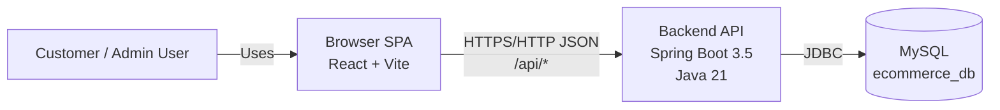
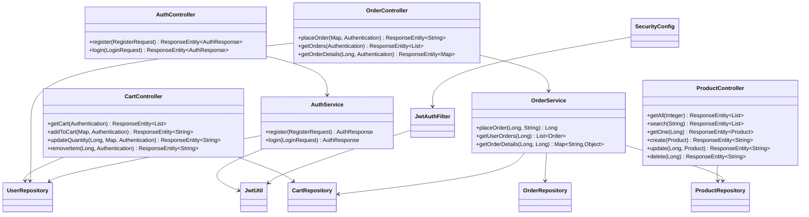
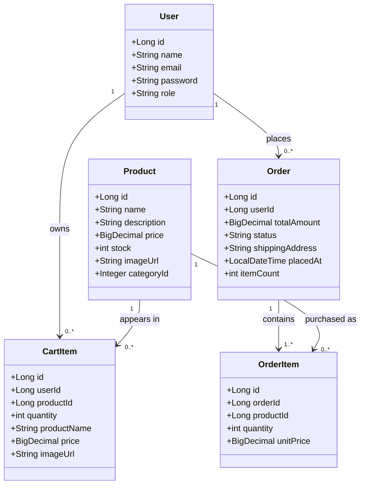
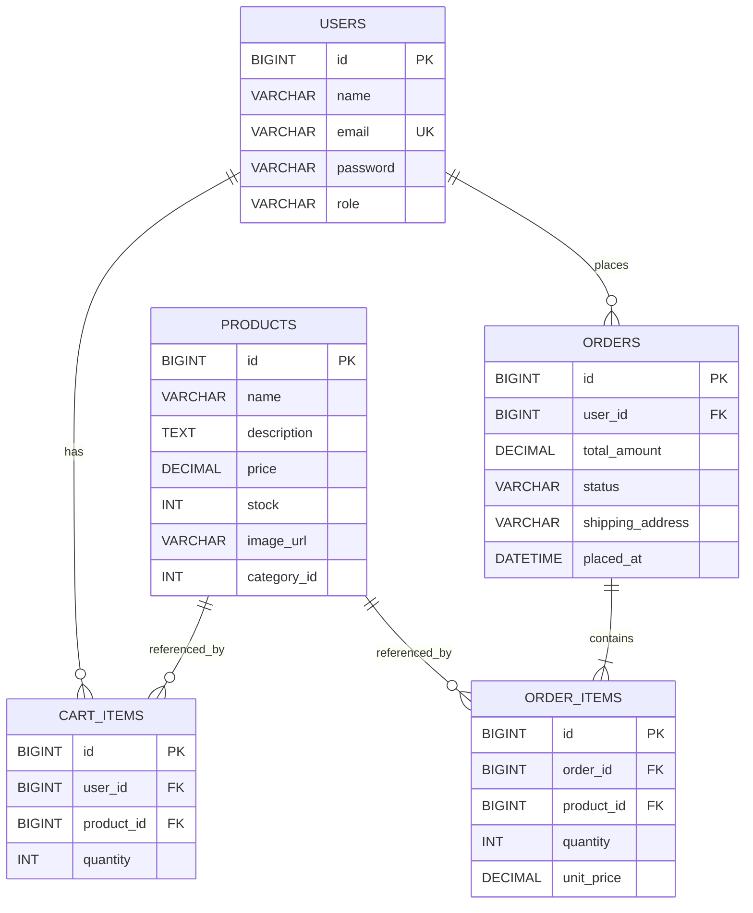
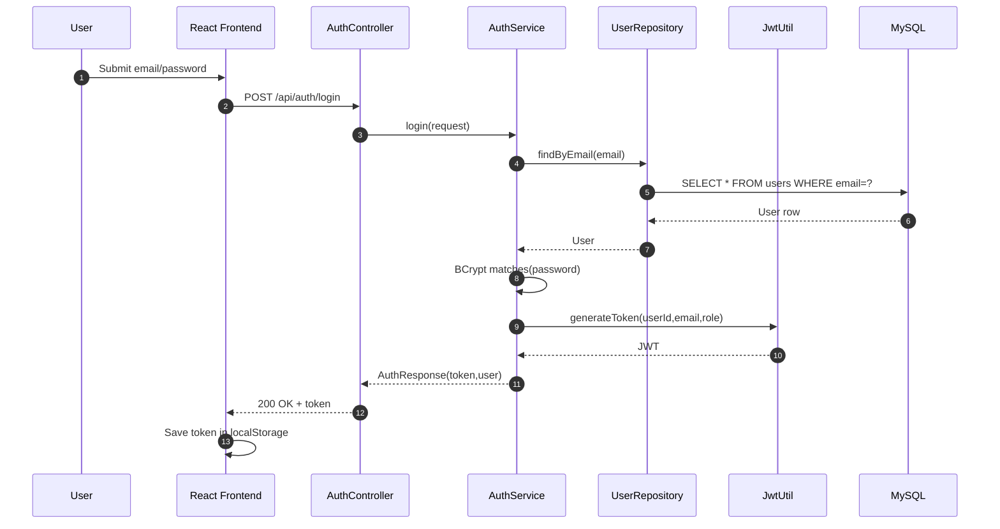
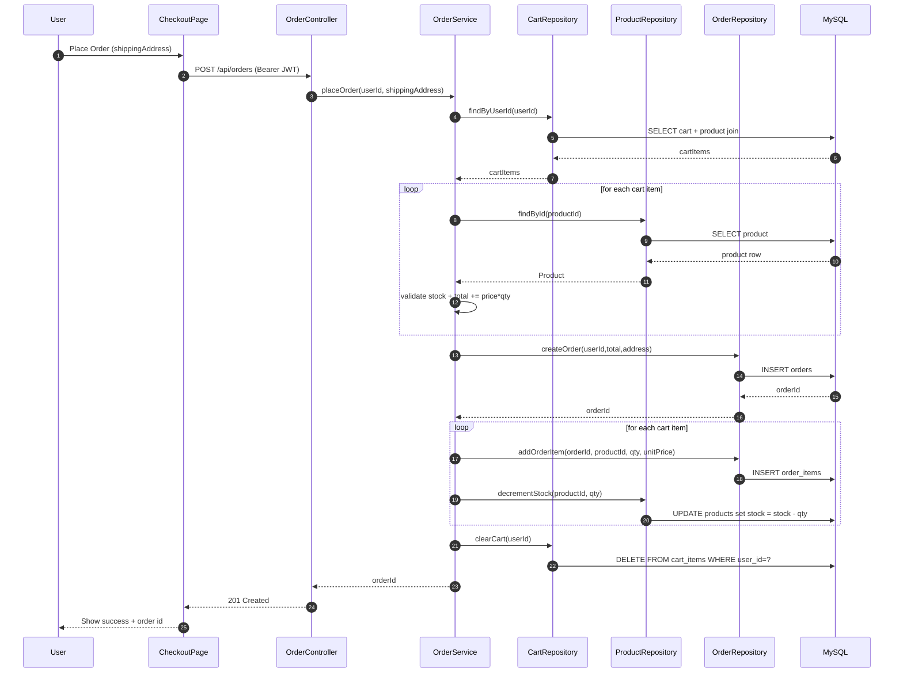
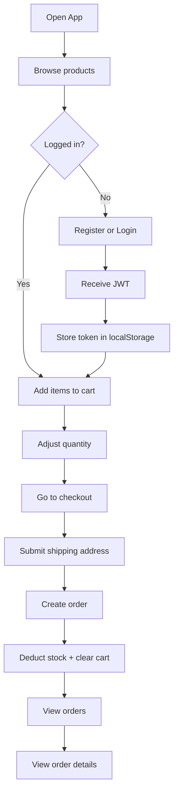
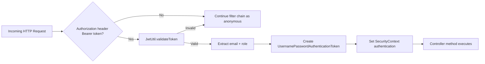
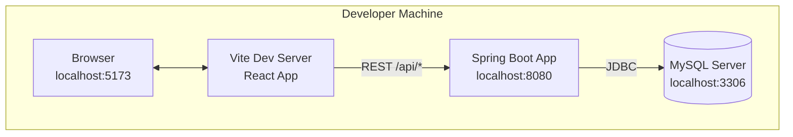
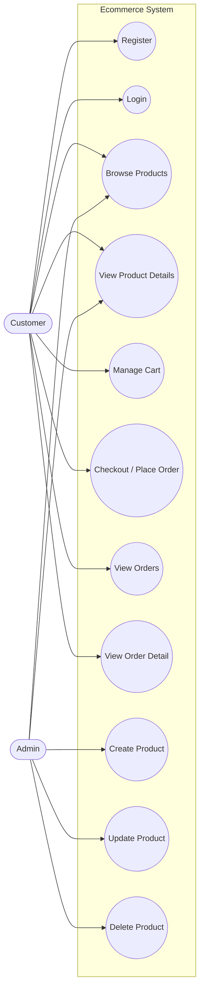

# Ecommerce Application Architecture and UML Diagrams

This document provides architecture and UML diagrams for the Ecommerce project.
All diagrams are written in Mermaid so they render directly in Markdown viewers that support Mermaid.

## 1) System Context Diagram



## 2) C4-Style Container Diagram

```mermaid
flowchart TB
    subgraph Client[Client Layer]
        SPA[Frontend SPA\nReact Router\nAuthContext\nCartContext\nAxios Interceptors]
    end

    subgraph Server[Application Layer]
        CTRL[Controllers\nAuth, Product, Cart, Order]
        SRV[Services\nAuthService, OrderService]
        SEC[Security\nSecurityConfig + JwtAuthFilter + JwtUtil]
        REPO[Repositories\nUser/Product/Cart/Order\n(JdbcTemplate)]
    end

    subgraph Data[Data Layer]
        MYSQL[(MySQL)]
        T1[(users)]
        T2[(products)]
        T3[(cart_items)]
        T4[(orders)]
        T5[(order_items)]
    end

    SPA --> CTRL
    CTRL --> SRV
    CTRL --> REPO
    SRV --> REPO
    CTRL --> SEC
    SRV --> SEC
    REPO --> MYSQL

    MYSQL --- T1
    MYSQL --- T2
    MYSQL --- T3
    MYSQL --- T4
    MYSQL --- T5
```

## 3) Backend Component Diagram



## 4) Domain Class Diagram (Entity Model)



## 5) Database ER Diagram



## 6) Authentication Sequence Diagram (Login)



## 7) Order Placement Sequence Diagram (Checkout)



## 8) Activity Diagram (User Journey)



## 9) Security Flow Diagram (JWT Request Lifecycle)



## 10) Deployment Diagram (Local Dev)



## 11) Frontend Route Map Diagram

```mermaid
flowchart LR
    ROOT[/ /] --> HOME[HomePage]
    ROOT --> PRODUCTS[/products/]
    ROOT --> PRODUCT_ID[/products/:id/]
    ROOT --> LOGIN[/login/]
    ROOT --> REGISTER[/register/]

    ROOT --> CART[/cart/ (Protected)]
    ROOT --> CHECKOUT[/checkout/ (Protected)]
    ROOT --> ORDERS[/orders/ (Protected)]
    ROOT --> ORDER_ID[/orders/:id/ (Protected)]
```

## 12) UML Use Case Diagram



## 13) Suggested Diagram Usage

- Use sections 1-2 for architecture overview slides.
- Use sections 3-5 for technical design and data model documentation.
- Use sections 6-9 for API behavior and security explanation.
- Use sections 10-11 for deployment and frontend navigation walkthrough.

