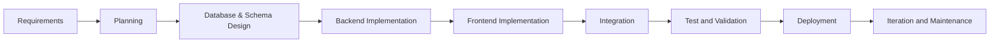
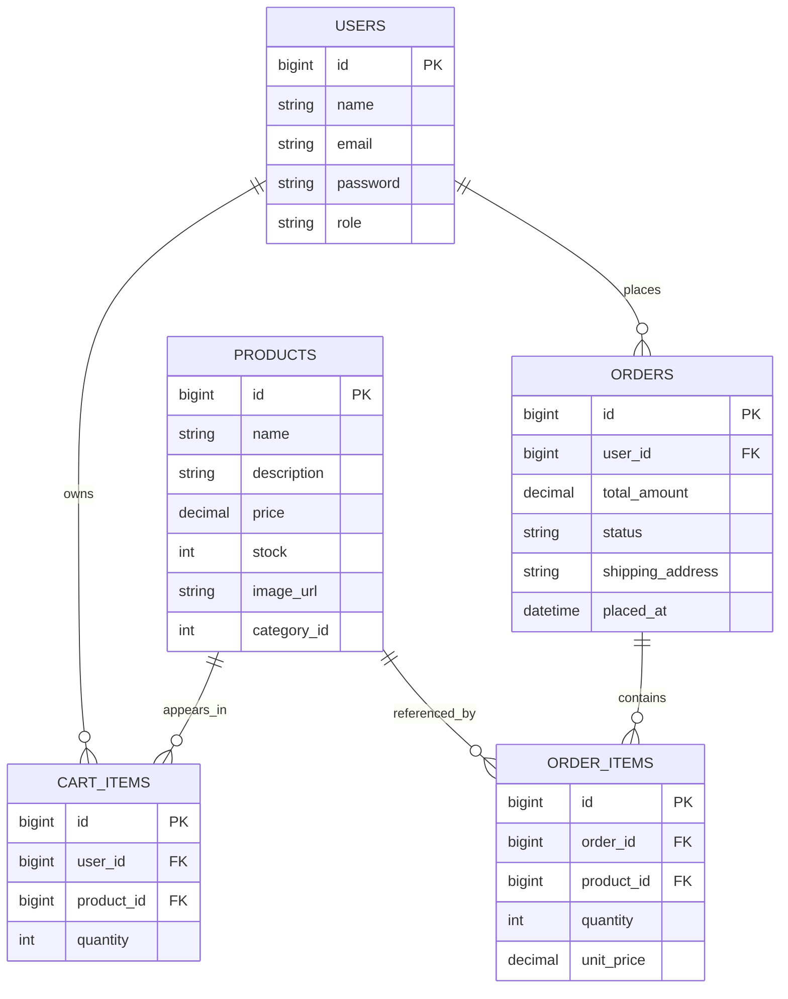
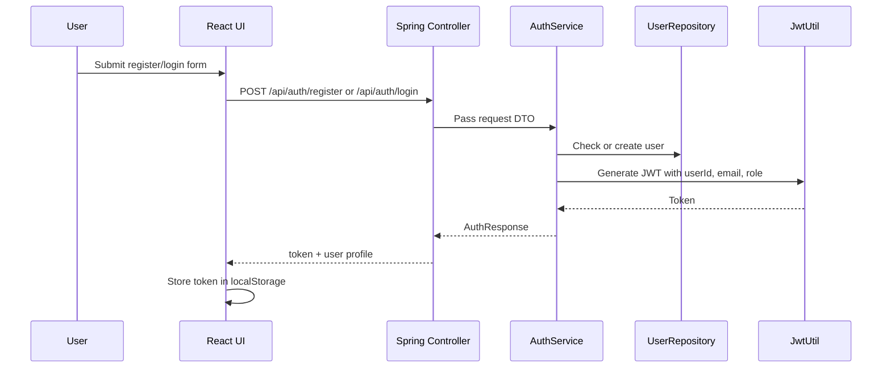
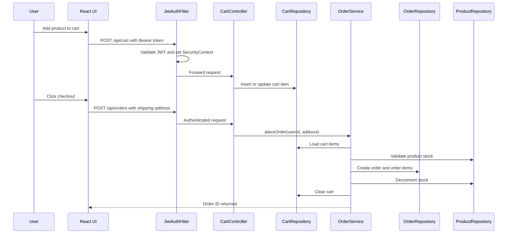
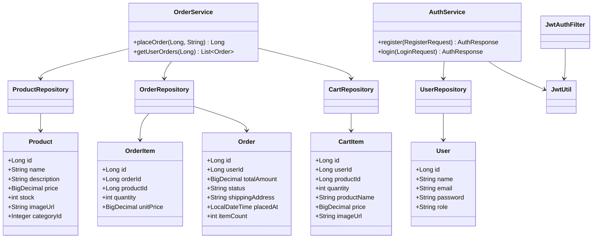

# Ecommerce Application Analysis Report

## 1. Overview

This workspace contains a split-stack ecommerce application with a Spring Boot backend and a React/Vite frontend. The backend exposes REST APIs for authentication, products, cart operations, and order placement. The frontend consumes those APIs through Axios, manages auth and cart state with React context, and protects checkout-related routes behind authentication.

## 2. SDLC Lifecycle

The project follows a practical SDLC path that can be described as:



### Requirements

The application is designed around a typical ecommerce flow:

- browse products
- search and filter items
- register and login
- add items to cart
- place an order
- review order history

### Planning

The architecture clearly separates responsibilities into backend MVC layers and frontend UI layers. The backend uses stateless JWT authentication, while the frontend stores the token locally and attaches it to API calls.

### Database and Schema Planning

The schema is not stored as a migration file in the repository, so the schema must be inferred from the JDBC repositories and model classes. The current data model is centered on five tables: users, products, cart_items, orders, and order_items.

### Implementation

Implementation is already split between controller, service, repository, model, DTO, and utility layers on the backend, and pages/components/context/api layers on the frontend.

### Validation

The frontend already has lint and build support through Vite scripts. The backend has Spring Boot test scaffolding, but the repository does not show a complete test suite or schema migration framework.

## 3. Spring Boot Setup

### Backend Stack

- Spring Boot 3.5.11
- Java 21
- Spring Web
- Spring Security
- Spring JDBC
- MySQL Connector/J
- JJWT 0.12.6
- Lombok

### Application Bootstrap

The application starts from [backend/src/main/java/com/ecommerce/EcommerceApplication.java](backend/src/main/java/com/ecommerce/EcommerceApplication.java). The backend is configured through [backend/src/main/resources/application.properties](backend/src/main/resources/application.properties).

### Runtime Configuration

- server port: 8080
- datasource: MySQL database named `ecommerce_db`
- connection pooling: HikariCP settings are present
- JWT secret and expiration are configured in properties
- logging is set to DEBUG for the application and Spring Security

### Security Design

The backend is stateless and uses a custom JWT filter. Public endpoints are limited to auth and product read APIs. Product write endpoints are restricted to ADMIN users via method security.

Key files:

- [backend/src/main/java/com/ecommerce/config/SecurityConfig.java](backend/src/main/java/com/ecommerce/config/SecurityConfig.java)
- [backend/src/main/java/com/ecommerce/filter/JwtAuthFilter.java](backend/src/main/java/com/ecommerce/filter/JwtAuthFilter.java)
- [backend/src/main/java/com/ecommerce/util/JwtUtil.java](backend/src/main/java/com/ecommerce/util/JwtUtil.java)
- [backend/src/main/java/com/ecommerce/config/CorsConfig.java](backend/src/main/java/com/ecommerce/config/CorsConfig.java)

## 4. Database Planning and Schema

There is no SQL schema file or migration tool in the repository, so the database design is inferred from the Java model classes and JDBC SQL statements.

### Planned Tables

| Table | Purpose | Main Columns |
| --- | --- | --- |
| `users` | Registered customers and admins | `id`, `name`, `email`, `password`, `role` |
| `products` | Product catalog | `id`, `name`, `description`, `price`, `stock`, `image_url`, `category_id`, `created_at` |
| `cart_items` | User cart lines | `id`, `user_id`, `product_id`, `quantity` |
| `orders` | Order headers | `id`, `user_id`, `total_amount`, `status`, `shipping_address`, `placed_at` |
| `order_items` | Order line items | `id`, `order_id`, `product_id`, `quantity`, `unit_price` |

### Schema Notes

- `users.email` is intended to be unique.
- `cart_items` is designed to support upsert behavior for repeated adds of the same product.
- `order_items.unit_price` stores a snapshot of price at purchase time.
- `orders` stores a summary and `order_items` stores the line-level details.
- `products.price` uses `BigDecimal`, which is the correct choice for money.

### Schema Gap

The main gap is that the project does not include a `schema.sql`, Flyway migration, or Liquibase changelog. That means the schema definition currently lives only in application code and database setup outside the repository.

### ER Diagram



## 5. MVC Architecture and Directory Structure

### Backend MVC

The backend follows a clear MVC-inspired separation, though it uses JDBC instead of JPA.

- Controllers receive HTTP requests and return responses.
- Services contain business rules and transaction boundaries.
- Repositories perform SQL operations with `JdbcTemplate`.
- Models represent the domain objects.
- DTOs carry request and response payloads.

Relevant structure:

```text
backend/src/main/java/com/ecommerce/
├── controller
├── service
├── repository
├── model
├── dto
├── config
├── filter
└── util
```

### Frontend Structure

The frontend is organized by route, shared UI, and application state.

```text
frontend/src/
├── api
├── components
├── context
├── pages
├── utils
├── App.jsx
├── main.jsx
├── App.css
└── index.css
```

## 6. End-to-End Request Flow

### Authentication Flow



### Cart to Order Flow



## 7. UML Style Class View



## 8. Frontend UI Preferences

The UI has a strong visual direction rather than a neutral admin-template look.

### Visual Style

- soft rose and blush color palette
- warm accent colors for highlights and calls to action
- rounded cards and pill badges
- glassy surfaces with subtle blur and shadows
- hero section with a looping video background
- sticky top navigation with icon-based actions
- responsive product grid and mobile-friendly cards

### Typography

- `Sora` is used for body text
- `Space Grotesk` is used for headings
- the typography choice gives the UI a more editorial and branded feel

### Interaction Patterns

- route-based navigation through React Router
- protected flows for cart, checkout, and orders
- optimistic-feeling cart interactions with quantity controls
- simple status messaging on auth and checkout screens

### UI Files

- [frontend/src/index.css](frontend/src/index.css)
- [frontend/src/components/Navbar.jsx](frontend/src/components/Navbar.jsx)
- [frontend/src/components/ProductCard.jsx](frontend/src/components/ProductCard.jsx)
- [frontend/src/pages/HomePage.jsx](frontend/src/pages/HomePage.jsx)
- [frontend/src/pages/ProductListPage.jsx](frontend/src/pages/ProductListPage.jsx)
- [frontend/src/pages/CartPage.jsx](frontend/src/pages/CartPage.jsx)
- [frontend/src/pages/CheckOutPage.jsx](frontend/src/pages/CheckOutPage.jsx)

## 9. Implementation Ideas

The project is already functional as an MVP, but the following additions would make it stronger and easier to maintain:

- add database migrations with Flyway or Liquibase
- move secrets out of `application.properties` and into environment variables
- add DTO validation for login, registration, checkout, and product admin actions
- add a global exception handler for consistent API errors
- add pagination for product and order endpoints
- add backend tests for auth, cart, and checkout flows
- add API documentation with OpenAPI/Swagger
- split checkout payment method into a persisted order field if it is meant to be tracked
- add admin UI screens for product management
- add inventory and low-stock reporting for the catalog

## 10. End-to-End Summary

From the user perspective, the flow is straightforward:

1. The user lands on the storefront and browses featured products.
2. The user registers or logs in through the auth page.
3. The frontend stores the JWT and sends it with API requests.
4. The user adds products to the cart and adjusts quantities.
5. The checkout page collects shipping and payment preference.
6. The backend validates cart contents, checks stock, creates the order, creates order items, reduces stock, and clears the cart.
7. The orders page shows the user’s order history.

## 11. Repository References

- [backend/pom.xml](backend/pom.xml)
- [backend/src/main/resources/application.properties](backend/src/main/resources/application.properties)
- [backend/src/main/java/com/ecommerce/config/SecurityConfig.java](backend/src/main/java/com/ecommerce/config/SecurityConfig.java)
- [backend/src/main/java/com/ecommerce/service/OrderService.java](backend/src/main/java/com/ecommerce/service/OrderService.java)
- [backend/src/main/java/com/ecommerce/repository/OrderRepository.java](backend/src/main/java/com/ecommerce/repository/OrderRepository.java)
- [frontend/package.json](frontend/package.json)
- [frontend/src/App.jsx](frontend/src/App.jsx)
- [frontend/src/index.css](frontend/src/index.css)
- [frontend/src/context/AuthContext.jsx](frontend/src/context/AuthContext.jsx)
- [frontend/src/context/CartContext.jsx](frontend/src/context/CartContext.jsx)

## 12. Recent Enhancements

- **Cart Management**: Added the ability to decrease the quantity of items from the cart. This feature was integrated into `ProductCard`, `ProductDetailPage`, and `CartPage` components. Items are automatically removed from the cart if the quantity reaches zero.
- **Order Details**: Implemented a full Order Details page (`OrderDetailPage.jsx`) to view specific items and order metadata. The "View Details" button on the `OrdersPage` now routes to this detailed view.
- **Backend Order Support**: Added new backend endpoints (`GET /api/orders/{orderId}`) and repository queries to support fetching detailed order information, including joining with the products table to display item details.
